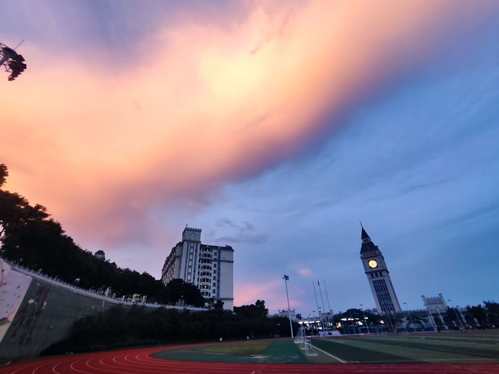
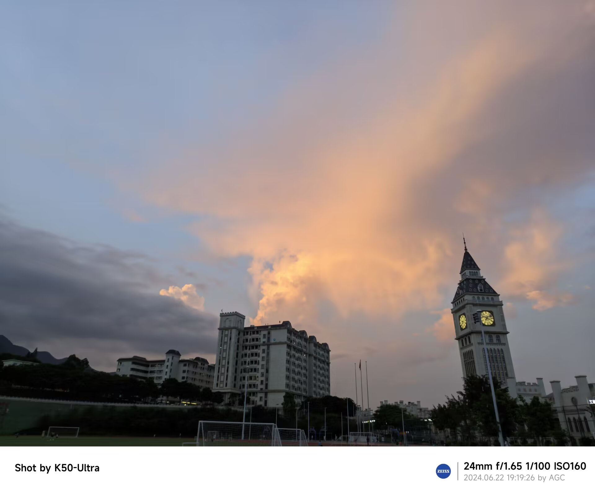

# 大二的期末作业  
~~其实只是为了方便版本回溯~~  ，然后再顺便在开发的过程中熟悉git的操作  
本项目预期开发的页面：  
- [ ] 登录页面
- [ ] 首页
- [ ] 新闻
- [ ] 社区
- [ ] 文化康养（~~专门用来整活的页面~~）  
第一次编辑时间：2024.06.17
---  
目前项目开发进度  
- [ ] 登录页面
- [x] 首页
- [x] 新闻
- [ ] 社区
- [ ] 文化康养（~~专门用来整活的页面~~）  
另外，虽然我的技术确实不好，但是现在已经拉黑ant-design-vue（，文档都还没写正确，然后写的也不够明白。前2024.06.20的晚上把整个项目都用element-plus重写了一遍，不过还好因为进度还不是快完成了（只是因为官方文档看的不明白，不会用，导致一直卡进度，问fitten code也没问出来怎么做）
今天很几把热，跑步差点中暑了（汗）不过云是很好看的   
第二次编辑时间：2024.06.22
---  
目前项目开发进度  
- [x] 登录页面
- [x] 首页
- [x] 新闻
- [x] 社区
- [x] 文化康养（~~专门用来整活的页面~~）
铛铛！全部都已经开发完毕~
原本的社区板块也拿来整活了×整活的太高兴了（  这才是我想看到的舞台啊！🦒💦💦💦💦  

 
后记：byd！我说了没多久就强制要让我用ant-design来开发微商城是吧？敢不敢跟我比划比划？！让你知道什么叫做黑手党！阿弥诺斯！哈比下！  
第三次编辑时间：2024.06.25

